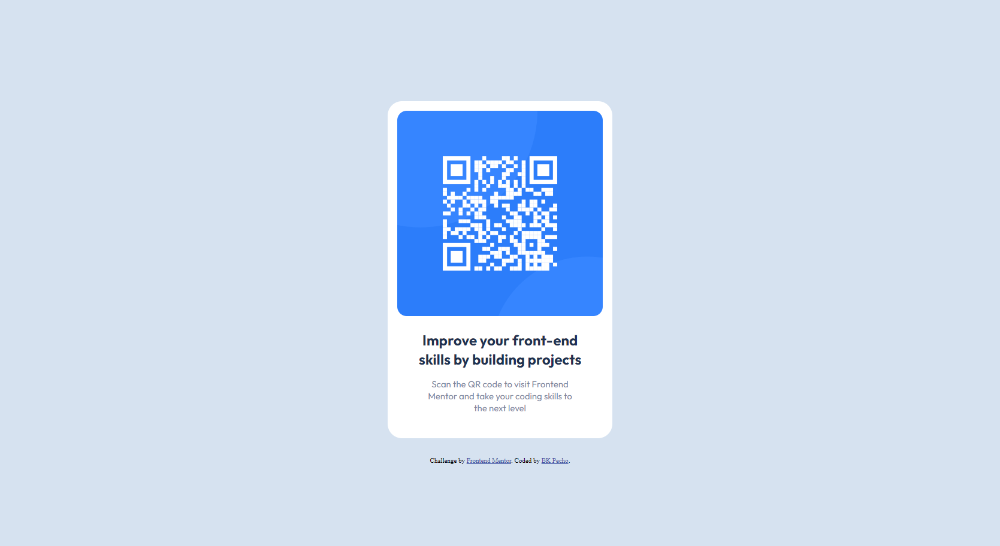
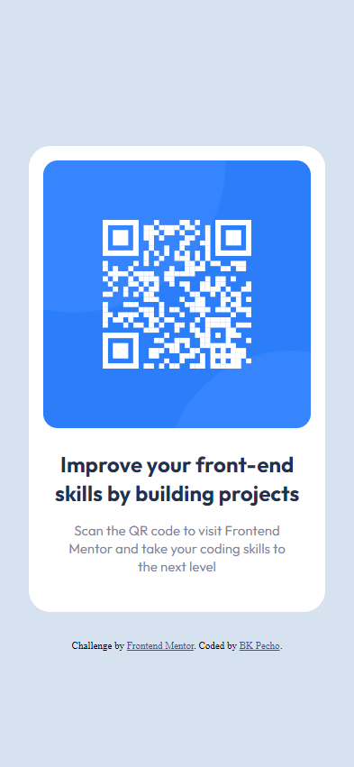

# Frontend Mentor - QR code component solution

This is a solution to the [QR code component challenge on Frontend Mentor](https://www.frontendmentor.io/challenges/qr-code-component-iux_sIO_H). Frontend Mentor challenges help you improve your coding skills by building realistic projects.

## Table of contents

- [Overview](#overview)
  - [The challenge](#the-challenge)
  - [Screenshot](#screenshot)
  - [Links](#links)
- [My process](#my-process)
  - [Built with](#built-with)
  - [What I learned](#what-i-learned)
- [Author](#author)

## Overview

This is a project that I completed as part of a front-end challenge on Frontend Mentor. The challenge was to create a responsive QR code component with both desktop and mobile views using HTML and CSS. Additionally, this project is also my submission to the #100DaysOfCode challenge.

### The challenge

Users should be able to:

- View the optimal layout depending on their device's screen size
- See hover states for interactive elements

### Screenshot

### Links

- Solution URL: https://www.frontendmentor.io/solutions/qr-code-component-using-flexbox-4b0KiykMIt
- Live Site URL: https://bk-qr-code-component.netlify.app

### Built with

- Semantic HTML5 markup
- CSS custom properties
- Flexbox
- Mobile-first workflow

### What I learned

Improved HTML and CSS skills: Through the creation of this project, I was able to practice and improve my HTML and CSS skills, including using HTML to structure the content and CSS to style it.

By working on this project, I was able to strengthen my existing skills and gain new knowledge, which will be valuable as I continue to develop my abilities as a frontend developer.

## Author

- Github - [BK Pecho](https://www.github.com/bkpecho)
- Frontend Mentor - [@bkpecho](https://www.frontendmentor.io/profile/bkpecho)
- Twitter - [@bkpecho](https://www.twitter.com/bkpecho)
